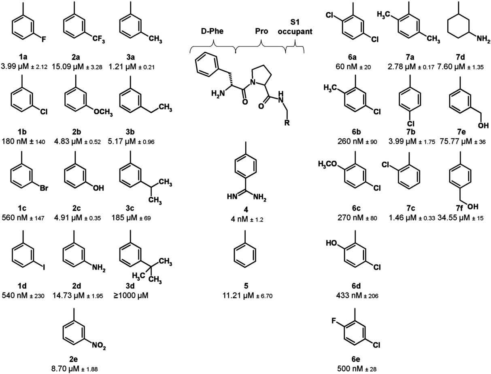

# ligand modification ddG
We are going to play with ligand modification in gromacs and [DP tech uniFEP](https://www.dp.tech/). The system we are going to play is from [this paper](http://dx.doi.org/10.1016/j.jmb.2009.04.051)  
There is also a [pmx tutorial](http://pmx.mpibpc.mpg.de/summerSchool2020_tutorial2/index.html) on this system using no-eq TI.

# Introduction
## Experiment result
| PDB  | ligand | dG(kJ/mol)|dG(kcal/mol)|
|------|--------|-----------|------------|
| 3D49 | apo    | None      | None       |
| 2ZDA | 4      | −46.1±0.6 |-11.01      |
| 2ZC9 | 1b     | −35.4±0.8 | -8.46      |
| 2ZDV | 1a     | −31.3±0.2 | -7.48      |
| 2ZF0 | 3a     | −34.8±0.6 | -8.31      |
| 2ZFF | 5      | −31.7     | -7.57      |



# ddg 3a > 5
## 1.GMX equilibrium FEP without enhanced sampling
pymol  
```
fetch 2ZFF, type=pdb
fetch 2ZF0, type=pdb
set retain_order, 1
set cartoon_transparency, 0.5
```

ligand 5  
```
grep 53U ../../2zff.pdb  | grep -v ANISOU > lig.pdb
# add H by GView
antechamber -i lig_H.pdb -fi pdb  -o lig_H.mol2 -fo mol2 -c bcc -nc 0
parmchk2 -i lig_H.mol2 -f mol2 -o lig_H.frcmod
tleap -f ../tleap.in
acpype -p MOL.prmtop -x MOL.rst7
``` 

ligand 3a
```
grep 51U ../../2zf0.pdb > lig.pdb
# add H by GView
antechamber -i lig_H.pdb -fi pdb  -o lig_H.mol2 -fo mol2 -c bcc -nc 0
parmchk2 -i lig_H.mol2 -f mol2 -o lig_H.frcmod
tleap -f ../tleap.in
acpype -p MOL.prmtop -x MOL.rst7
```
pmx  
```
one_ff_file.py -ffitp lig_3a/atomtype.itp lig_5/atomtype.itp -ffitp_out ffMOL.itp
atoms_to_morph.py -i1 lig_3a/MOL_tleap.pdb -i2 lig_5/MOL_tleap.pdb -o pairs.dat -alignment -H2H
# Pls manually edit pairs.dat before move on 
make_hybrid.py \
  -l1 lig_3a/MOL_tleap.pdb \
  -l2 lig_5/MOL_tleap.pdb \
  -itp1 lig_3a/MOL.itp \
  -itp2 lig_5/MOL.itp \
  -pairs pairs.dat \
  -oa merged.pdb \
  -oitp MOL.itp \
  -ffitp ffmerged.itp \
  -scDUMd 0.0
one_ff_file.py -ffitp ffmerged.itp ffMOL.itp -ffitp_out ffMOL_dum.itp
```
wat
```
gmx editconf -f ../ligand/merged.pdb -o 01_box.gro -bt dodecahedron -d 1.17 
gmx solvate -cp 01_box.gro -cs spc216.gro -p topol.top -o 02_solv.gro 
gmx grompp -f em.mdp -c 02_solv.gro  -p topol.top -o 03_ion
gmx genion -s 03_ion.tpr  -o 04_ion_added.gro -p topol.top  -pname NA -nname CL -np 3 -nn 3
```
pro
```
gmx pdb2gmx -f ../2zff_02_tleap.pdb -o 2zff_03_pdb2gmx.pdb -ignh
gmx editconf -f 2zff_04_complex.pdb -o 05_box.gro -bt dodecahedron -d 1.1
gmx solvate -cp 05_box.gro -cs spc216.gro -p topol.top -o 06_solv.gro
gmx grompp -f ../wat/em.mdp -c 06_solv.gro -o 07_ions
gmx genion -s 07_ions.tpr -o 08_ion.pdb -p topol.top -pname NA -nname CL -nn 27 -np 27
```
## 2.uniFEP with the default setting