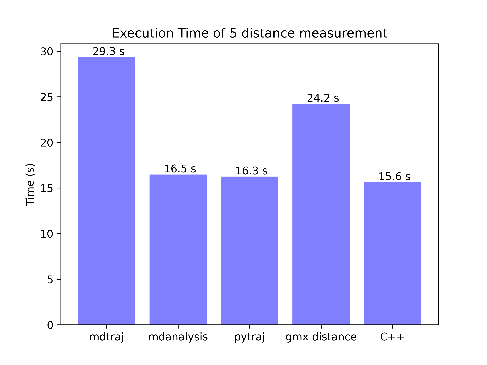

# MDAnalysis, mdtraj, pytraj  
## 1.Installation

### 1.1 For MDAnalysis and mdtraj  
```bash
conda create -n mda MDAnalysis mdtraj pandas -c conda-forge
```

### 1.2 For pytraj
```bash
conda create -n pytraj -c ambermd pytraj pandas
```
pytraj-linux only works with py3.5/3.6/3.7, pytraj-Mac only works with py3.5/3.6/3.7/3.8.    
See the [doc](https://anaconda.org/AmberMD/pytraj/)

### 1.3 Compile C++ code
Download and compile gromacs
```
cd speed_test_distance/05-GMXLIB_CPP/
mkdir build
cd build

source ~/Software/GMX/2022.5-cuda11.7-gcc11/bin/GMXRC
# This is where you installed gromacs.

cmake  ../ -DGROMACS_SRC_DIR=/home/cheng/Software/Package/GMX/2022.5/gromacs-2022.5
# This is the gromacs source code folder that you downloaded from GMX website.

make
```

### 1.X Remove conda environment
After all the tesing, if you don't want to keep those conda environment, do this.
```bash
conda remove -n Name_of_Env --all  # You need to deactivate before removing
```

## 2 Speed test
I only uploaded a short trajectory.
```bash
cd data/
mv fix_atom_c_40ps_short.xtc fix_atom_c_40ps.xtc
cd ../speed_test_distance/
./run_all.sh
```
Here is my test result with longer trajectory.

