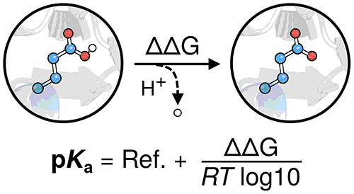
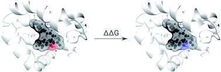
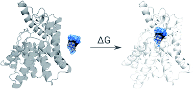
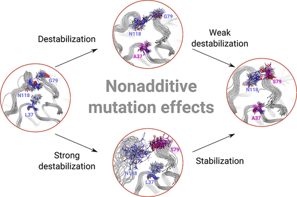
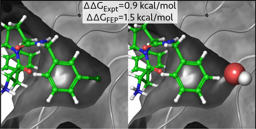
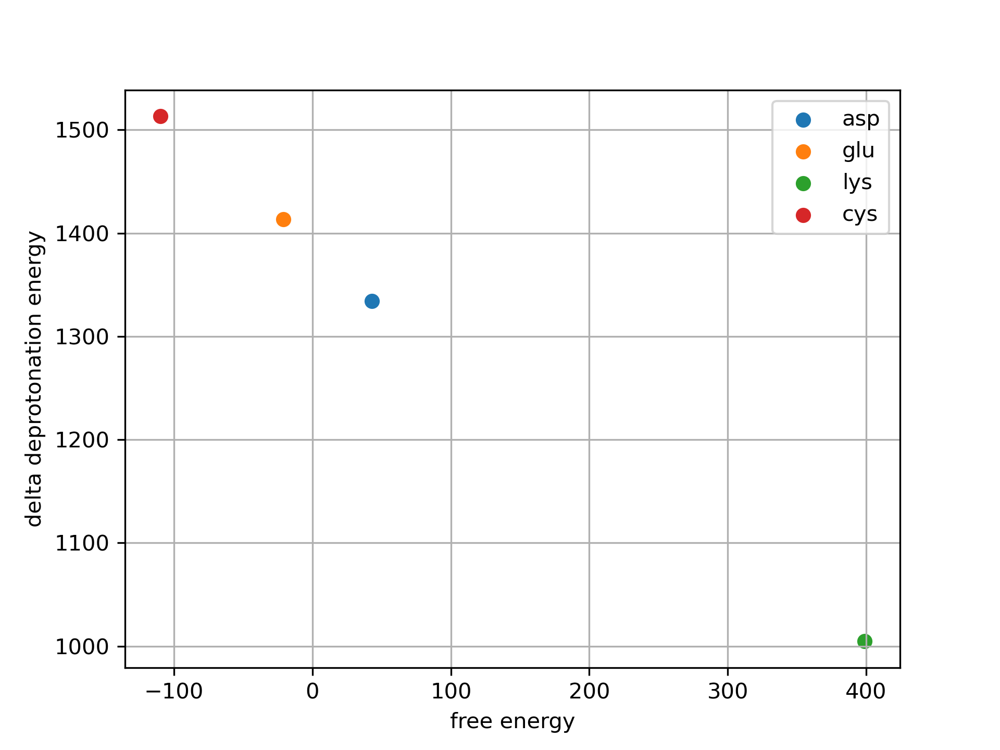

# 1. Ref

<table>
<tr>
  <td></td>
  <td>
    <a href="https://doi.org/10.1021/acs.jctc.3c00721">Accurately Predicting Protein pKa Values Using Nonequilibrium Alchemy</a> 
    Carter J. Wilson, Mikko Karttunen, Bert L. de Groot, and Vytautas Gapsys*
  </td>
</tr>

<tr>
  <td></td>
  <td>
    <a href="https://doi.org/10.1039/C9SC03754C">Large scale relative protein ligand binding affinities using non-equilibrium alchemy</a> 
     Vytautas Gapsys, Laura Pérez-Benito, Matteo Aldeghi, Daniel Seeliger, Herman van Vlijmen, Gary Tresadern* and Bert L. de Groot*
  </td>
</tr>

<tr>
  <td></td>
  <td>
    <a href="https://doi.org/10.1039/D1SC03472C">Alchemical absolute protein–ligand binding free energies for drug design</a> 
    Y. Khalak, G. Tresadern, M. Aldeghi, H. M. Baumann, D. L. Mobley, B. L. de Groot and V. Gapsys*
  </td>
</tr>

<tr>
  <td></td>
  <td>
    <a href="https://doi.org/10.1021/acs.jpclett.1c00380">One Plus One Makes Three: Triangular Coupling of Correlated Amino Acid Mutations</a> 
    Martin Werner, Vytautas Gapsys, and Bert L. de Groot*
  </td>
</tr>

<tr>
  <td></td>
  <td>
    <a href="https://doi.org/10.1021/ja512751q">Accurate and Reliable Prediction of Relative Ligand Binding Potency in Prospective Drug Discovery by Way of a Modern Free-Energy Calculation Protocol and Force Field</a> 
    Lingle Wang ... 
  </td>
</tr>

</table>

# 2. Potential Energy Zero Point Error
  
y axis is the delta deprotonation potential energy (QM_deprotonation - MM_deprotonation)  
x axis is the deprotonation free energy error between the experiment and Charmm36m  
